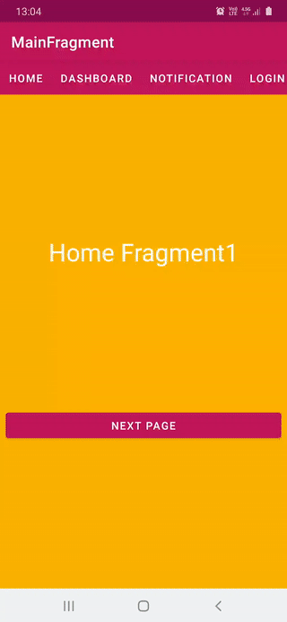
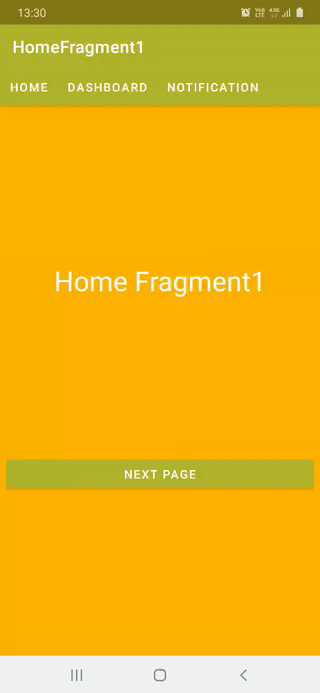
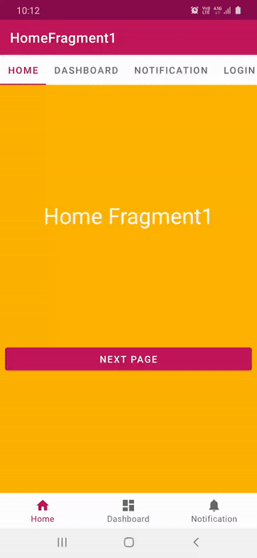
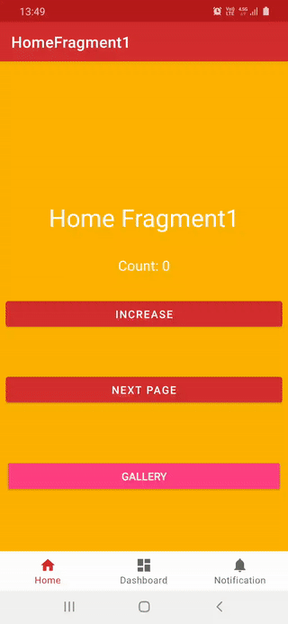
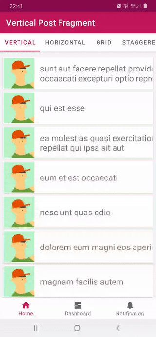

# Navigation Components Tutorials
Tutorials for learning Navigation Components starting with simple set up, continues with adding top menus, passing arguments via navigation graphs and combining them with different Material Design widgets such as ```BottomNavigationView```, ```Toolbar```, ```ViewPager2```, ```TabLayout``` and **dynamic feature module** navigation with ```DynamicNavHostFragment```.

## Overview
* Add, navigation graph and navigate to fragments with actions and animations
    * [Tutorial1-1Navigation-NavGraph](https://github.com/SmartToolFactory/NavigationComponents-Tutorials/tree/master/Tutorial1-1Navigation-NavGraph)

* Nested navigation graphs, NavHostFragment and navigation
    * [Tutorial1-2Navigation-NestedNavGraph](https://github.com/SmartToolFactory/NavigationComponents-Tutorials/tree/master/Tutorial1-3Navigation-NestedNavHost)

* Nested navigation with a NavHostFragment and back press handled with OnBackPressedCallback
    * [Tutorial1-3Navigation-NestedNavHost](https://github.com/SmartToolFactory/NavigationComponents-Tutorials/tree/master/Tutorial1-3Navigation-NestedNavHost)

* Set navigation with toolbar, NavigationView and use top menu buttons to navigate
    * [Tutorial4-1NavigationUI-NavigationView](https://github.com/SmartToolFactory/NavigationComponents-Tutorials/tree/master/Tutorial4-1NavigationUI-NavigationView)

* BottomNavigationView with simple navigation
    * [Tutorial5-1NavigationUI-BottomNavigation](https://github.com/SmartToolFactory/NavigationComponents-Tutorials/tree/master/Tutorial5-1NavigationUI-BottomNavigation)

* BottomNavigation with extension to create individual NavHostFragments and listen back stack changes
    * [Tutorial5-3NavigationUI-BottomNavigation-NestedNavigation](https://github.com/SmartToolFactory/NavigationComponents-Tutorials/tree/master/Tutorial5-3NavigationUI-BottomNavigation-NestedNavigation)

* Examine memory leaks when extension function setupWithNavController for BottomNavigationView is inside a fragment
    * [Tutorial5-4NavigationUI-MemoryLeakCheck](https://github.com/SmartToolFactory/NavigationComponents-Tutorials/tree/master/Tutorial5-4NavigationUI-MemoryLeakCheck)

* ViewPager2 inside a fragment with single navigation graph, navigates from the fragment ViewPager2 is in to next one
    * [Tutorial6-0NavigationUI-ViewPager2](https://github.com/SmartToolFactory/NavigationComponents-Tutorials/tree/master/Tutorial6-0NavigationUI-ViewPager2)

* Same tutorial as the previous one but data binding used this time to examine and solve memory leaks due to data binding
    * [Tutorial6-1NavigationUI-ViewPager2](https://github.com/SmartToolFactory/NavigationComponents-Tutorials/tree/master/Tutorial6-1NavigationUI-ViewPager2)

* ViewPager2 navigation with each page has it's own back stack or fragment that wraps/contains NavHostFragment
    * [Tutorial6-2NavigationUI-ViewPager2-NestedNavHost](https://github.com/SmartToolFactory/NavigationComponents-Tutorials/tree/master/Tutorial6-2NavigationUI-ViewPager2-NestedNavHost)

* ViewPager2 navigation with each page has it's own back stack or fragment that wraps/contains NavHostFragment
    * [Tutorial6-2NavigationUI-ViewPager2-NestedNavHost](https://github.com/SmartToolFactory/NavigationComponents-Tutorials/tree/master/Tutorial6-2NavigationUI-ViewPager2-NestedNavHost)

* ViewPager2 inside an Activity, and topbar title and current NavController is set using a liveData(This does not work after rotation)
    * [Tutorial6-3NavigationUI-ViewPager2-Appbar-NestedNavigation-LiveData](https://github.com/SmartToolFactory/NavigationComponents-Tutorials/tree/master/Tutorial6-3NavigationUI-ViewPager2-Appbar-NestedNavigation-LiveData)

* ViewPager2 and fragments with their own Toolbar, FragmentTransactionCallback is used for navigating ViewPager2 pages back stack properly
    * [Tutorial6-4NavigationUI-ViewPager2-FragmentToolbar-NestedNavigation](https://github.com/SmartToolFactory/NavigationComponents-Tutorials/tree/master/Tutorial6-4NavigationUI-ViewPager2-FragmentToolbar-NestedNavigation)

* ViewPager2 navigation when both it's child fragments and parent fragment have Toolbar of their own, and navigation from differnt layers
    * [Tutorial6-5NavigationUI-ViewPager2-FragmentToolbar-MixedNavigation](https://github.com/SmartToolFactory/NavigationComponents-Tutorials/tree/master/Tutorial6-5NavigationUI-ViewPager2-FragmentToolbar-MixedNavigation)

* ViewPager2 and TabLayout complex navigation with changing navigation in fragments different layers of navigation
    * [Tutorial6-6NavigationUI-ViewPager2-Appbar-MixedNavigation-ViewModel](https://github.com/SmartToolFactory/NavigationComponents-Tutorials/tree/master/Tutorial6-6NavigationUI-ViewPager2-Appbar-MixedNavigation-ViewModel)

* BottomNavigationView using ViewPager2 to have tabs with their own back stack.
    * [Tutorial7-1BNV-ViewPager2-NestedNavigation](https://github.com/SmartToolFactory/NavigationComponents-Tutorials/tree/master/Tutorial7-1BNV-ViewPager2-NestedNavigation)

* BottomNavigationView navigation through it's tabs, and navigating ViewPager2 is inside a tab of BottomNavigationView.
    * [Tutorial7-2BNV-ViewPager2-ComplexArchitecture](https://github.com/SmartToolFactory/NavigationComponents-Tutorials/tree/master/Tutorial7-2BNV-ViewPager2-ComplexArchitecture)

* Using REST api, complex navigation with layers(Total 3 layers of navigation) when ViewPager2 is inside a tab of BottomNavigationView
    * [Tutorial7-3BNV-ViewPager2-FragmentToolbar-MixedNavigation](https://github.com/SmartToolFactory/NavigationComponents-Tutorials/tree/master/Tutorial7-3BNV-ViewPager2-FragmentToolbar-MixedNavigation)

* Implementation of Dynamic Feature Module navigation, passing data and using SavedStateHandle to get data on back press
    * [Tutorial8-1DynamicFeatures-Navigation](https://github.com/SmartToolFactory/NavigationComponents-Tutorials/tree/master/Tutorial8-1DynamicFeatures-Navigation)

*  Using REST api, complex navigation with layers with ViewPager2 in BottomNavigationView and Dynamic Feature Modules.
    * [Tutorial8-2DynamicFeatures-ComplexArchitecture](https://github.com/SmartToolFactory/NavigationComponents-Tutorials/tree/master/Tutorial8-2DynamicFeatures-ComplexArchitecture)

## Tutorial Coverage

### [Tutorial0-0MaterialDesign](https://github.com/SmartToolFactory/NavigationComponents-Tutorials/tree/master/Tutorial0-0MaterialDesign)
Covers basic BottomNavigationView and ViewPager usage without any navigatiom components. This is a little bit like warm up before moving to more complex ones including navigation with ViewPager2

### [Tutorial1-Navigation-NavGraph](https://github.com/SmartToolFactory/NavigationComponents-Tutorials/tree/master/Tutorial1-1Navigation-NavGraph)
Covers how to use create navigation graph ```nav_graph.xml``` inside navigation folder, and  ```NavHostFragment```in ```activity_main.xml``` layout file.

### Note
One important note to add is navigation uses FragmentTransaction.replace() to navigate next fragment inside specified ```NavHostFragment```

```
    <androidx.fragment.app.FragmentContainerView
        android:id="@+id/nav_host_fragment"
        android:name="androidx.navigation.fragment.NavHostFragment"
        android:layout_width="0dp"
        android:layout_height="0dp"
        app:layout_constraintBottom_toBottomOf="parent"
        app:layout_constraintLeft_toLeftOf="parent"
        app:layout_constraintRight_toRightOf="parent"
        app:layout_constraintTop_toTopOf="parent"

        app:defaultNavHost="true"
        app:navGraph="@navigation/nav_graph" />
```

There are multiple ways to navigate from one fragment to another using a ```NavController```, for instance

```

buttonCenter?.setOnClickListener {

    val options = navOptions {
        anim {
            enter = R.anim.slide_in_right
            exit = R.anim.slide_out_left
            popEnter = R.anim.slide_in_left
            popExit = R.anim.slide_out_right
        }
    }

    findNavController().navigate(R.id.middle1_dest, null, options)
}

```

Check out this tutorial if you wish to get familiar with basic consepts, animation and navigating with ```popUpTo```and ```popUpToInclusive```

### [Tutorial1-2Navigation-NestedNavGraph](https://github.com/SmartToolFactory/NavigationComponents-Tutorials/tree/master/Tutorial1-3Navigation-NestedNavHost)

Uses seperate and nested fragments with each it's own navigation graph.

```nav_graph``` is the main graph for navigation has navigation to **CameraFragment** or other graphs such as ```nav_graph_dashboard``` or ```nav_graph_home```
Nested graphs are part of the same ```navHostFragment?.childFragmentManager```

### [Tutorial1-3Navigation-NestedNavHost](https://github.com/SmartToolFactory/NavigationComponents-Tutorials/tree/master/Tutorial1-3Navigation-NestedNavHost)

Covers how nested graphs with their own back stack or ```NavHostFragment``` work. You can check out both main and home childFragmentManager back stack entry and fragment count by examining Toast or log messages.

### Note
Main graph back stack is controlled by ```NavHostFragment.getChildFragmentManager```

When a nested navigation graph or ```NavHostFragment``` is added it's back stack is retrieved
using a childFragmentManager.

When a fragment is from a nested navigation graph is on screen when you navigate back or forth it's current position
changes only for the current NavHostFragment, main back stack does not change.

 ```
 val callback = object : OnBackPressedCallback(false) {

    override fun handleOnBackPressed() {

        // Get NavHostFragment
        val navHostFragment =
            childFragmentManager.findFragmentById(nestedNavHostFragmentId)
        // ChildFragmentManager of the current NavHostFragment
        val navHostChildFragmentManager = navHostFragment?.childFragmentManager

        // Check if it's the root of nested fragments in this navhosts
        if (navController?.currentDestination?.id == navController?.graph?.startDestination) {

            /*
                Disable this callback because calls OnBackPressedDispatcher
                 gets invoked  calls this callback  gets stuck in a loop
             */
            isEnabled = false
            requireActivity().onBackPressed()
            isEnabled = true

        } else if (isVisible) {
            navController?.navigateUp()
        }

    }
}

 ```

### Note
Back navigation does NOT work for the first fragment in back stack of ```HomeNavHostFragment``` for this example, because

 ```
if (navController!!.currentDestination == null || navController!!.currentDestination!!.id == navController!!.graph.startDestination) {
    navController?.navigate(R.id.homeFragment1)
}
 ```

and start destination is ```HomeNavHostFragment```itself , but  last fragment, currentDestination on graph is  ```HomeFragment1``` when back button is pressed while ```HomeFragment2``` is on screen.

Change ```app:startDestination="@id/home_dest"``` to ```app:startDestination="@id/homeFragment1"```  to solve back press issue for ```HomeNavHostFragment```, it's just set to demonstrate how start destination change back press.

  ```
 <navigation xmlns:android="http://schemas.android.com/apk/res/android"
        xmlns:app="http://schemas.android.com/apk/res-auto"
        xmlns:tools="http://schemas.android.com/tools"
        android:id="@+id/nav_graph_home"
        app:startDestination="@id/home_dest">

    <fragment
            android:id="@+id/home_dest"
            android:name="com.smarttoolfactory.tutorial1_3navigation_nestednavhost.navhost.HomeNavHostFragment"
            android:label="HomeHost"
            tools:layout="@layout/fragment_navhost_home" />

    <fragment
            android:id="@+id/homeFragment1"
            android:name="com.smarttoolfactory.tutorial1_3navigation_nestednavhost.blankfragment.HomeFragment1"
            android:label="HomeFragment1"
            tools:layout="@layout/fragment_home1">

    </fragment>

</navigation>
 ```

### [Tutorial6-0NavigationUI-ViewPager](https://github.com/SmartToolFactory/NavigationComponents-Tutorials/tree/master/Tutorial6-0NavigationUI-ViewPager)

**Navigation Architecture**

```
MainActivity (Appbar + Toolbar)
|- MainNavHost
    |
    | FragmentViewPagerContainer(ViewPager2 + TabLayout)
        |- HomeFragment1 -> HomeFragment2 -> HomeFragment3
        |- DashboardFragment1 -> DashboardFragment2 -> DashboardFragment3
```

Covers how to create a ```ViewPager2```with navigation in main back stack, in this example ```ViewPager2```pages do not have their own back stacks. It's covered in tutorial Tutorial6-2.


<p align="center">
    
</p>

### [Tutorial6-1NavigationUI-ViewPager](https://github.com/SmartToolFactory/NavigationComponents-Tutorials/tree/master/Tutorial6-1NavigationUI-ViewPager2)

Same as previous tutorial except only with one difference,  ```data binding``` is used for binding.

### Note
Data binding that is not null(or non-nullable) after ```Fragment.onDestroyView``` when ```ViewPager2```is inside a fragment causing leak canary to show data binding related **MEMORY LEAK** for this fragment when used in ```ViewPager2```. Also you need to set adapter of ViewPager2 either to prevent memory leaks, and another one is due to TabLayouts which is covered in later sections. Check out this [stackoverflow question](https://stackoverflow.com/questions/62851425/viewpager2-inside-a-fragment-leaks-after-replacing-the-fragment-its-in-by-navig) for more details.

### [Tutorial6-2NavigationUI-NestedNavHost](https://github.com/SmartToolFactory/NavigationComponents-Tutorials/tree/master/Tutorial6-2NavigationUI-NestedNavHost)

**Navigation Architecture**

```

 MainActivity (Appbar + Toolbar)
    |- MainNavHost
       |
       |- ViewPagerContainerFragment(ViewPager2 + TabLayout)
       |   |- HomeNavHostFragment
       |   |  |- HF1 -> HF2 -> HF3
       |   |
       |   |- DashboardNavHostFragment
       |   |  |- DF1 -> DF2 -> DF3
       |   |
       |   |- NotificationHostFragment
       |   |  |- NF1 -> NF2 -> NF3
       |   |
       |   |-LoginFragment1
       |
       |- LoginFragment1 -> LoginFragment2
```

Covers ```ViewPager2``` and it's pages each with it's own back stack or navigation graphs.

```
NavHostFragment use NavController to navigate back/forth in any page.
```

<p align="center">
    
</p>

### Note
This tutorial has very important aspects for ```ViewPager2``` navigation

1. Creating ```NavHostFragment``` for each page and can navigate inside them, each page has
    it's own nav graph.

    in each layout file ```NavHostFragment``` inside is retrieved using
    ```
            val nestedNavHostFragment =
                childFragmentManager.findFragmentById(nestedNavHostFragmentId) as? NavHostFragment
            navController = nestedNavHostFragment?.navController`
    ```

    ```HomeNavHostFragment``` uses the first fragment that is displayed on screen **HomeFragment1 while   ```DashboardNavHostFragment``` uses graph with itself as start destination so it should check for the ```NavController.getCurrentDestination()``` to navigate to it when device rotated

    ```LoginFragment1``` is added to main graph, because of that appbar back navigation only works with the ```ViewPagerContainerFragment```'s ```NavController```

2. How to use back navigation with ```OnBackPressedCallback```, there is an alternative and more simple way
    to handle back navigation for ```ViewPager2``` but this also a way to keep in mind if more customization is required.
    If you do not handle back navigation Activity's back press gets called and application starts from onCreate.

3. Checking out memory leaks with data binding, ViewPager2 adapter and lifecylce.
     * You should set **data binding** to **null** or you will get memory leaks for this ViewPager2 which is itself also inside a fragment

     * You should set ViePager2's adapter to null in ```onDestroyView```

     * 🔥 You should use ```ChildFragmentStateAdapter(fragmentManager: FragmentManager, lifecycle: Lifecycle)```, not
     the one that takes ```Fragment``` as parameter.
     And use **view's lifecycle** instead of setting Fragment's lifecycle.

     ```
     viewPager.adapter =
                        ChildFragmentStateAdapter(childFragmentManager, viewLifecycleOwner.lifecycle)
     ```

Refer to this [stackoverflow question](https://stackoverflow.com/questions/61779776/leak-canary-detects-memory-leaks-for-tablayout-with-viewpager2) for more details.

### [Tutorial6-3NavigationUI-ViewPager2-Appbar-NestedNavigation-LiveData](https://github.com/SmartToolFactory/NavigationComponents-Tutorials/tree/master/Tutorial6-3NavigationUI-ViewPager2-Appbar-NestedNavigation-LiveData)

**Navigation Architecture**

```
 MainActivity(Appbar + Toolbar + TabLayout + ViewPager2)
   |
   |- HomeNavHostFragment
   |  |- HF1 -> HF2 -> HF3
   |
   |- DashboardNavHostFragment
   |  |- DF1 -> DF2 -> DF3
   |
   |- NotificationHostFragment
      |- NF1 -> NF2 -> NF3
```

In this tutorial  MainActivity has it's appbar that navigation is controlled using the ```NavController``` retrieved from ```NavHostFragment```  via  ```LiveData```

<p align="center">
    
</p>

### Note

There is an issue with rotation, when device rotated ``` ActivityFragmentStateAdapter.createFragment```  method is not called and it's not possible to access ```NavController``` of newly created fragments. If you do not wish to have a rotatable app
you can use live data or ViewModel to get current ```NavController``` to change appbar title and get other
properties of ```NavController```. LiveData is observed in ```MainActivity``` to set appbar title


### [Tutorial6-4NavigationUI-ViewPager2-FragmentToolbar-NestedNavigation](https://github.com/SmartToolFactory/NavigationComponents-Tutorials/tree/master/Tutorial6-4NavigationUI-ViewPager2-FragmentToolbar-NestedNavigation)

 **Navigation Architecture**

 ```
  MainActivity
     |- MainNavHost
        |
        |- ViewPagerContainerFragment(ViewPager)
            |
            |- HomeNavHostFragment(Appbar + Toolbar)
            |  |- HF1 -> HF2 -> HF3
            |
            |- DashboardNavHostFragment(Appbar Toolbar)
            |  |- DF1 -> DF2 -> DF3
            |
            |- NotificationHostFragment(Appbar Toolbar)
               |- NF1 -> NF2 -> NF3

 ```

In this tutorial each ```NavHostFragment``` has it's own toolbar
 They can navigate back with back arrow when navigated to an inner/nested fragment in pages of ViewPager

<p align="center">
    
</p>

 Using ```FragmentStateAdapter.registerFragmentTransactionCallback``` with ```FragmentStateAdapter``` solves back navigation instead of using ```OnBackPressedCallback.handleOnBackPressed``` in every ```NavHostFragment``` as answered [here](https://stackoverflow.com/a/62629996/5457853)

 ```
 init {
     // Add a FragmentTransactionCallback to handle changing
     // the primary navigation fragment
     registerFragmentTransactionCallback(object : FragmentTransactionCallback() {
         override fun onFragmentMaxLifecyclePreUpdated(
             fragment: Fragment,
             maxLifecycleState: Lifecycle.State
         ) = if (maxLifecycleState == Lifecycle.State.RESUMED) {

             // This fragment is becoming the active Fragment - set it to
             // the primary navigation fragment in the OnPostEventListener
             OnPostEventListener {
                 fragment.parentFragmentManager.commitNow {
                     setPrimaryNavigationFragment(fragment)
                 }
             }

         } else {
             super.onFragmentMaxLifecyclePreUpdated(fragment, maxLifecycleState)
         }
     })
 }
```

If defaultNavHost is not set to true true for any ```NavHostFragments```  by setting  ```app:defaultNavHost="true"``` in xml or programmatically
snippet above will not work.

### [Tutorial6-5NavigationUI-ViewPager2-FragmentToolbar-MixedNavigation](https://github.com/SmartToolFactory/NavigationComponents-Tutorials/tree/master/Tutorial6-5NavigationUI-ViewPager2-FragmentToolbar-MixedNavigation)

 **Navigation Architecture**

 ```
 MainActivity
    |- MainNavHost
       |
       |- ParenNavHost((Appbar + Toolbar)
           |
           |- ViewPagerContainerFragment(ViewPager2)
           |   |
           |   |- HomeNavHostFragment(Appbar + Toolbar)
           |   |  |- HF1 -> HF2 -> HF3
           |   |
           |   |- DashboardNavHostFragment(Appbar + Toolbar)
           |   |  |- DF1 -> DF2 -> DF3
           |   |
           |   |- NotificationHostFragment(Appbar + Toolbar)
           |   |  |- NF1 -> NF2 -> NF3
           |   |
           |   |-LoginFragment1
           |
           |- LoginFragment1 -> LoginFragment2

 ```

In this tutorial each ```NavHostFragment``` has it's own toolbar, also ```ParentNavHostFragment``` has it's own toolbar either.

<p align="center">
    
</p>

LoginFragment2 in this example is added to  back stack of ParentNavHostFragment because of that it does not have any association with toolbar in  ```ViewPagerContainerFragment```

ParentNavHostFragment's role is to have it's own Appbar to contain login fragments and navigate through them using Appbar. Without ```ParentNavHostFragment``` we navigate to ```LoginFragment2``` that has no Appbar.

Visibility of ```ParentNavHostFragment``` is changed via liveData of ```AppbarViewModel```

 However, there is an issue whenever Toolbar that is not belong to fragments appear or disappear.


### [Tutorial6-6NavigationUI-ViewPager2-Appbar-MixedNavigation-ViewModel](https://github.com/SmartToolFactory/NavigationComponents-Tutorials/tree/master/Tutorial6-6NavigationUI-ViewPager2-Appbar-MixedNavigation-ViewModel)

**Navigation Architecture**

  ```
 MainActivity
    |- MainNavHostFragment
       |
       |- ParenNavHostFragment(Appbar + Toolbar) Here because we wish to have toolbar inside Fragment
           |
           |- ViewPagerContainerFragment(TabLayout + ViewPager2)
           |   |
           |   |- HomeNavHostFragment
           |   |  |- HF1 -> HF2 -> HF3
           |   |
           |   |- DashboardNavHostFragment
           |   |  |- DF1 -> DF2 -> DF3
           |   |
           |   |- NotificationHostFragment
           |   |  |- NF1 -> NF2 -> NF3
           |   |
           |   |-LoginFragment1
           |
           |- LoginFragment1 -> LoginFragment2

  ```

In this tutorial, only ```ParentNavHostFragment``` has Appbar and Toolbar. Navigation of individual
NavHostFragments is done via LiveData belong to ```AppbarViewModel.currentNavController``` which
returns ```NavController``` of current ```NavHostFragment``` on screen due. Current ```NavController``` is set ```onResume``` to make sure to
set it only when the current fragment is visible, it's instead of checking if fragment is on screen and visible.

<p align="center">
    
</p>

```ParentNavHostFragment```'s role is to have it's own Appbar to contain login fragments and navigate through them using Appbar. Without ParentNavHostFragment we navigate to ```LoginFragment2``` that has no Appbar if it's inside ```ViewPagerContainerFragment```.

It can be done by putting Appbar to ```MainActivity``` but purpose here is to put
 Appbar + Toolbar inside a fragment to be able to use with ```BottomNavigationView``` for instance


### [Tutorial7-1BNV-ViewPager2-NestedNavigation](https://github.com/SmartToolFactory/NavigationComponents-Tutorials/tree/master/Tutorial7-1BNV-ViewPager2-NestedNavigation)

**Navigation Architecture**

  ```
   MainActivity(BottomNavigationView + ViewPager2 + Appbar + Toolbar)
         |- HomeNavHostFragment
         |   |- HF1 -> HF2 -> HF3
         |
         |- DashboardNavHostFragment
         |   |- DF1 -> DF2 -> DF3
         |
         |- NotificationHostFragment
         |   |- NF1 -> NF2 -> NF3

  ```

In this example ```BottomNavigationView``` selects which page of ```ViewPager2``` should be opened using
```BottomNavigationView.setOnNavigationItemSelectedListener```

<p align="center">
    
</p>

Appbar title is changed using  LiveData ```AppbarViewModel.currentNavController``` of visible ```NavHostFragment```  on screen of ViePager2 page


Change current nav controller to set appbar title

```
appbarViewModel.currentNavController.observe(this, Observer { it ->

    it?.let { event: Event<NavController> ->
        event.getContentIfNotHandled()?.let { navController ->
            val appBarConfig = AppBarConfiguration(navController.graph)
            dataBinding.toolbar.setupWithNavController(navController, appBarConfig)
        }
    }
})

```

### [Tutorial7-2BNV-ViewPager2-ComplexArchitecture](https://github.com/SmartToolFactory/NavigationComponents-Tutorials/tree/master/Tutorial7-2BNV-ViewPager2-ComplexArchitecture)

**Navigation Architecture**

  ```
       MainActivity(BottomNavigationView + ViewPager2 + Appbar + Toolbar)
          |
          |- ViewPagerContainerFragment(TabLayout + ViewPager2)
          |      |
          |      |- HomeNavHostFragment
          |      |  |- HF1 -> HF2 -> HF3
          |      |
          |      |- DashboardNavHostFragment
          |      |  |- DF1 -> DF2 -> DF3
          |      |
          |      |- NotificationHostFragment
          |      |  |- NF1 -> NF2 -> NF3
          |      |
          |      |-LoginFragment1
          |
          |- DashboardNavHostFragment
          |   |- DF1 -> DF2 -> DF3
          |
          |- NotificationHostFragment
          |   |- NF1 -> NF2 -> NF3
  ```

This example is combination of Tutorial6-6 and Tutorial 7-1


<p align="center">
    
</p>

 First tab of the ```BottomNavigationView``` is ```ViewPagerContainerFragment``` which has a ```ViewPager2``` that has it's own pages with each it's own back stack setting ```NavController``` is done both using ```AppbarViewModel``` and ```BottomNavigationView.setupWithNavController``` in the NavigationExtensions code for setting BottomNavigationView back stack.


### [Tutorial7-3BNV-ViewPager2-FragmentToolbar-MixedNavigation](https://github.com/SmartToolFactory/NavigationComponents-Tutorials/tree/master/Tutorial7-3BNV-ViewPager2-FragmentToolbar-MixedNavigation)

**Navigation Architecture**

  ```
    MainActivity
      |- MainNavHostFragment
           |
           |- ContainerNavHostFragment(BottomNavigationView  Appbar + Toolbar)
           |    |
           |    |- ViewPagerContainerFragment(ViewPager2 + TabLayout)
           |    |      |
           |    |      |- PostVerticalNavHost
           |    |      |  |- PostVerticalFragment -> PostDetailFragment
           |    |      |
           |    |      |- PostHorizontalNavHost
           |    |      |  |- PostHorizontalFragment -> PostDetailFragment
           |    |      |
           |    |      |- PostGridNavHostFragment
           |    |      |  |- PostGridFragment
           |    |      |
           |    |      |- PostStaggerNavHostFragment
           |    |      |  |- PostStaggeredFragment
           |    |      |
           |    |      |- NotificationHostFragment
           |    |      |  |- NF1 -> NF2 -> NF3
           |    |      |
           |    |      |- LoginFragment1
           |    |
           |    |
           |    |- DashboardNavHostFragment
           |    |   |- DF1 -> DF2 -> DF3
           |    |
           |    |- NotificationHostFragment
           |    |  |- NF1 -> NF2 -> NF3
           |    |
           |    |- &PostGridFragment -> PostDetailFragment
           |    |
           |    |- &LoginFragment1 -> LoginFragment2
           |
           |
           |- &PostStaggeredFragment -> PostDetailFragment
  ```

In this tutorial ```BottomNavigationView``` is inside ```MainFragment```. ```MainActivity``` can navigate to a different fragment other than the ```MainFragment``` using nav_graph main destinations.

<p align="center">
  
</p>

 Navigation is layered, fragments annotated with **&** display that hey navigate at that level, not actually added to that hierarchy.

 For instance, ```PostStaggeredFragment``` which is in ```ViewPager2``` calls snippet below to get main ```NavController``` to navigate in main navigation graph
 ```requireActivity().findNavController(R.id.main_nav_host_fragment).navigate(R.id.action_mainFragment_to_postDetailFragment, bundle)```

```PostGridFragment``` which is in ```ViewPager2``` gets ```PNavController```P that belong to ```ViewPagerContainerFragment``` via ```parentFragment?.parentFragment?.findNavController()``` and navigates from ```ViewPagerContainerFragment``` to ```PostDetailFragment```

### 🔥🔥🔥 Important

If you navigate from ```PostStaggeredFragment``` to ```PostDetailFragment``` fragment you will see that memory leak occurs. It happens due to BottomNavigationView.setupWithNavController``` function in ```NavigationExtensions.kt``` class leaking because of listeners not being unregistered in extension functions in ```onDestroyView``` of fragment.

Check out Tutorial8-2 for solution for this issue

### [Tutorial8-1DynamicFeatures-Navigation](https://github.com/SmartToolFactory/NavigationComponents-Tutorials/tree/master/Tutorial8-1DynamicFeatures-Navigation)

This tutorial to navigate to dynamic feature module from App, navigate from dynamic feature module  gallery to favorites.

<p align="center">
  
</p>

Steps to create dynamic navigation from app to dynamic feature modules, or from one dynamic feature module to another

1. Replace  ```android:name="androidx.navigation.fragment.NavHostFragment"``` with ```android:name="androidx.navigation.dynamicfeatures.fragment.DynamicNavHostFragment"``` for the layouts
```
<androidx.fragment.app.FragmentContainerView
    android:id="@+id/nestedDashboardNavHostFragment"
    android:name="androidx.navigation.dynamicfeatures.fragment.DynamicNavHostFragment"
    app:defaultNavHost="true"
    app:navGraph="@navigation/nav_graph_dashboard"/>
```

2. Add dynamic navigation with ```<include>```, ```<activity>``` or as fragmentt to any navigation graph
    * You don't have to use an id, but if you do, same id defined here must be used in dynamic feature module, or will get an error.
    * Add package name of dynamic feature module
    * Add nav graph name in navigation folder of dynamic feature module
    * Add module name which is also in app's build.gradle file
    * Optionally add arguments to pass to dynamic feature module fragments

 ```
 <!-- gallery dynamic feature module-->
 <include-dynamic
     android:id="@+id/nav_graph_gallery"
     android:name="com.smarttoolfactory.gallery"
     app:graphResName="nav_graph_gallery"
     app:moduleName="gallery">
     <argument
         android:name="count"
         android:defaultValue="0"
         app:argType="integer" />
 </include-dynamic>
 ```

3. In dynamic feature module navigation creata navigation graph to navigate in feature module fragmnent or navigate to other dynamic feature modueles, and passing arguments and getting the result from a fragment with ```savedStateHandle```.
    * id in dynamic feature module should not contain **+**, because you are using the same id resource defined in app or the snippet above. If you do you will have the error i got [here](https://stackoverflow.com/questions/62704720/dynamic-feature-module-navigation-illegalstateexception-the-included-navigatio)

 ```
 <?xml version="1.0" encoding="utf-8"?>
 <navigation xmlns:android="http://schemas.android.com/apk/res/android"
     xmlns:app="http://schemas.android.com/apk/res-auto"
     android:id="@id/nav_graph_gallery"
     app:moduleName="gallery"
     app:startDestination="@id/galleryFragment1">

     <fragment
         android:id="@+id/galleryFragment1"
         android:name="com.smarttoolfactory.gallery.GalleryFragment1"
         android:label="GalleryFragment1">
         <action
             android:id="@+id/action_galleryFragment1_to_galleryFragment2"
             app:destination="@id/galleryFragment2" />
         <action
             android:id="@+id/action_galleryFragment1_to_nav_graph_favorites"
             app:destination="@id/nav_graph_favorites" />
     </fragment>

     <!-- favorite dynamic feature module-->
     <include-dynamic
         android:id="@id/nav_graph_favorites"
         android:name="com.smarttoolfactory.favorites"
         app:graphResName="nav_graph_favorites"
         app:moduleName="favorites" >
         <argument
             android:name="count"
             app:argType="integer"
             android:defaultValue="0" />
     </include-dynamic>
 </navigation>

 ```

```HomeFragment1``` listen ```savedStateHandle``` with ```findNavController().currentBackStackEntry?.savedStateHandle.getLiveData<Int>```

```HomeFragment2``` and GalleryFragment sets result with ```findNavController().previousBackStackEntry?.savedStateHandle?.set("count", count)```

### [Tutorial8-2DynamicFeatures-ComplexArchitecture](https://github.com/SmartToolFactory/NavigationComponents-Tutorials/tree/master/Tutorial8-2DynamicFeatures-ComplexArchitecture)

**Navigation Architecture**

  ```
    MainActivity
      |- MainNavHostFragment
           |
           |- ContainerNavHostFragment(BottomNavigationView  Appbar + Toolbar)
           |    |
           |    |- ViewPagerContainerFragment(ViewPager2 + TabLayout)
           |    |      |
           |    |      |- PostVerticalNavHost
           |    |      |  |- PostVerticalFragment -> PostDetailFragment
           |    |      |
           |    |      |- PostHorizontalNavHost
           |    |      |  |- PostHorizontalFragment -> PostDetailFragment
           |    |      |
           |    |      |- PostGridNavHostFragment
           |    |      |  |- PostGridFragment
           |    |      |
           |    |      |- PostStaggerNavHostFragment
           |    |      |  |- PostStaggeredFragment
           |    |      |
           |    |      |- NotificationHostFragment
           |    |      |  |- NF1 -> NF2 -> NF3
           |    |      |
           |    |      |- LoginFragment1
           |    |
           |    |
           |    |- DashboardNavHostFragment
           |    |   |- DF1 -> DF2 -> DF3
           |    |
           |    |- NotificationHostFragment
           |    |  |- NF1 -> NF2 -> NF3
           |    |
           |    |- &PostGridFragment -> PostDetailFragment
           |    |
           |    |- &LoginFragment1 -> LoginFragment2
           |    |
           |    |- NF1 | 2F2 -> Camera Dynamic Feature
           |
           |
           |- DF1 | 2F2 -> Photo Dynamic Feature
           |
           |- NF1 | 2F2 -> Camera Dynamic Feature
           |
           |- &PostStaggeredFragment -> PostDetailFragment

           // Photos Dynamic feature navigate to Camera Dynamic feature
           |- Photos Dynamic Feature -> Camera Dynamic Feature
  ```

In this tutorial same as Tutorial 7-3 navigation layered, and navigation from app module to dynamic features, or navigation from ```Photos``` dynamic feature module
to ```Camera``` dynamic feature module is available.

<p align="center">
  
</p>

There are two versions of main fragment.

 One with ```MainFragment``` which uses ```BottomNavigationView``` extension, and ```MainFragmentWithViewPager``` uses ```ViewPager2``` to create back stack of ```BottomNavigationView```.

### Note

🔥 Since ```DynamicNavHostFragment``` used instead of ```NavHostFragment``` another extension should be written that creates fragments that have [DynamicNavHostFragment] in fragments.

If  ```BottomNavigationView``` extension is used with ```DynamicNavHostFragment``` it returns the error below
>       Caused by: java.lang.IllegalStateException: Could not find Navigator with name "include-dynamic". You must call NavController.addNavigator() for each navigation type.
>          at androidx.navigation.NavigatorProvider.getNavigator(NavigatorProvider.java:98)
>          at androidx.navigation.NavInflater.inflate(NavInflater.java:107)
>          at androidx.navigation.NavInflater.inflate(NavInflater.java:141)
>          at androidx.navigation.NavInflater.inflate(NavInflater.java:88)

Also, since extension is not used, observe that not getting  **MEMORY LEAK** that was present in Tutorial7-3

### ToDos:
- [ ] Use nav graph ViewModel by navGraphViewModels, couldn't find it yet
- [ ] Solve ```setFragmentResultListener``` issue to get result from a framgent on back press, and use instead of savedStateHandle
- [ ] Use saveStateHandle or save fragment state in Tutorial 8-2 when ViewPager2 moves away from viewPort
- [ ] There is a performance issue in Tutorial 8-2 when navigate back from StaggerPostListFragment, or navigating back to fragment main
- [ ] Use BottomNavigationView extension with ```DynamicNavHostFragment```, or create another extension for dynamic feature modules
